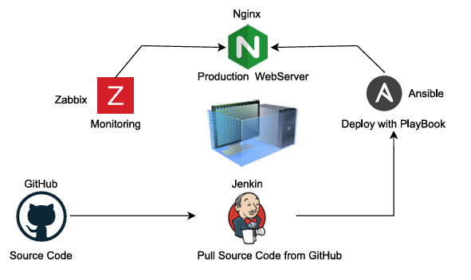

🌐 Infrastructure Lab for Web Application Deployment & Monitoring

📖 Infrastructure Overview
---------------------------
This project demonstrates a complete infrastructure lab designed for deploying and monitoring a web application. It brings together automation, monitoring, and continuous delivery to simulate a real-world production environment.

🛠️ Tech Stack
---------------
🌍 DNS (BIND) – Provides domain name resolution by mapping domain names to IP addresses, making the web application accessible with a human-friendly URL instead of raw IPs.

⚡ Nginx – A lightweight, high-performance web server used to serve the application. Known for its speed, scalability, and ease of configuration.

📊 Zabbix – A powerful monitoring solution that tracks the health, performance, and availability of servers and services. Ensures the system stays stable and issues are detected early.

🤖 Ansible – Handles automation and configuration management. With simple YAML playbooks, it automatically deploys and configures the web server environment, reducing manual effort.

🚀 Jenkins – A CI/CD pipeline tool that pulls the latest source code from GitHub and automates the build and deployment process, enabling continuous delivery.

💻 GitHub – The central repository where the main source code lives, enabling collaboration, version control, and seamless integration with Jenkins.

 ✨ Features
 -------------
🌐 Dual Network Setup – The server is equipped with two network interfaces:
-One dedicated to the public network for external access.
-One dedicated to the private network for internal communication and security.

🖥️ Windows Host Users – SSH Access

For users running Windows as the host system, a convenient batch file is provided:

File: ssh_vm1.bat

Purpose: Quickly establish an SSH connection to VM1 without manually typing commands.

💡 Simply double-click the file, and it will connect you directly to the VM via SSH.

🔎 DNS Service – The DNS (BIND) server operates independently to resolve and map domain names to the server’s IP address, making the application accessible with ease.

💻 Source Code Management – The application source code is stored in a GitHub repository.

Git has already been configured, and the project files are located at:
					/opt/web-project

📂 Configuration Management – A dedicated directory named stack-server is maintained under the root home directory.

-This is the central hub for all infrastructure configurations.
-The Ansible playbook (webserver.yml) is stored here.
-If any configuration changes are required, simply update and re-run the playbook to apply the automation process.

📊 Monitoring with Zabbix – Zabbix continuously monitors network bandwidth, server status, and overall system health, ensuring early detection of performance issues.

🚀 CI/CD Pipeline with Jenkins – Jenkins is pre-installed and configured for automation.
-Already connected with the GitHub source directory.
-Automatically pulls the latest code, builds, and redeploys whenever updates are made, enabling a smooth CI/CD workflow.

⚙️ Initial Setup for Deployment
---------------------------------
🔑 Credentials
Root Password → khaungMOE!1

🌐 Network Configuration

NIC 1 → NAT (Virtual)

NIC 2 → 192.168.100.10

🎮 Application & Monitoring Access
-Pokémon MiniGame → http://devops.host

-Zabbix Monitoring → http://192.168.100.10:8080

-Username: Zabbix

-Password: Admin

Jenkins CI/CD → http://192.168.100.10:8000

-Username: Ravil (Admin User)

-Password: khaungMOE!1

💻 Virtualization Setup
Download and install a Virtual Machine Manager of your choice:
-VirtualBox
-VMware

Import the .ovf file into your virtual machine manager.

🔄 Post-Import Steps

-Restart the named service to ensure domain resolution is working:
-systemctl restart named
Verify and update /etc/resolv.conf if necessary.

After completing these steps, all functions will be fully operational. 🚀
